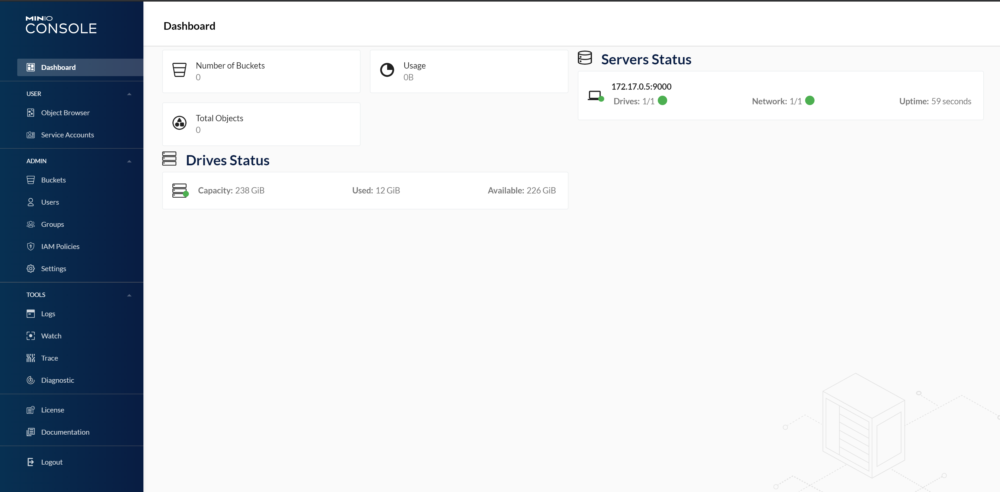

# MLLAb-Minio

<p align="center">
  
</p>

---

<br>

## Clone

- Clone this repo to your local machine using `https://github.com/GinaCha/MLLAb-Minio/tree/main`

---

## Running Dockerized Node-Red

<p align="justify">We can build and run the docker image using the following commands:</p>


```bash
    docker build -t mlllab-minio:0.1.0 .
    docker run --name=mlllab-minio -p 9000:9000 -p 9001:9001  -it  -v minio_data:/data --rm mlllab-minio:0.1.0 
```

---

<br>

## Authors

* **<a href="https://github.com/GinaCha" target="_blank">`Gina Chatzimarkaki`</a>.** - *Initial work* 

---

<br>

## License

This project is licensed under the Apache License  - see the [LICENSE](LICENSE) file for details

---

<br>

## Acknowledgments

- [Minio Github Repo](https://github.com/minio/minio)
- [minio/minio:RELEASE.2021-09-03T03-56-13Z.fips](https://hub.docker.com/layers/minio/minio/RELEASE.2021-09-03T03-56-13Z.fips/images/sha256-f3dc723cdf3dfba75b2b34e4e3e7c567da31fa9c5b978035569b622b6bd27ca9?context=explore)